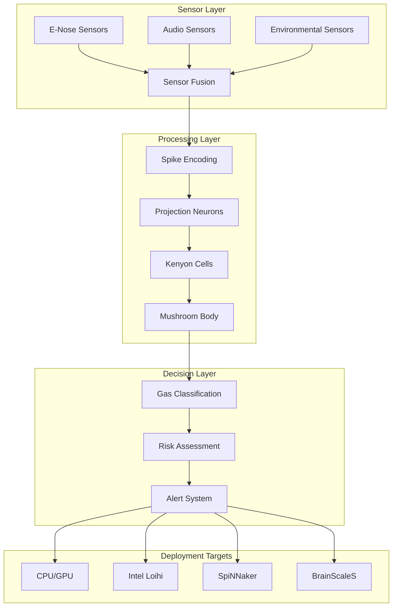

# BioNeuro-Olfactory-Fusion Architecture

## System Overview

BioNeuro-Olfactory-Fusion implements a bio-inspired neuromorphic computing framework for hazardous gas detection using spiking neural networks (SNNs). The system combines electronic nose (e-nose) sensor data with acoustic features for robust multi-modal chemical hazard identification.

## High-Level Architecture



## Component Architecture

### 1. Core Components (`bioneuro_olfactory/core/`)

#### Neurons Module
- **LIF Neurons**: Leaky Integrate-and-Fire neuron models
- **Adaptive Neurons**: Neurons with adaptive thresholds
- **Inhibitory Neurons**: Lateral inhibition for sparse coding

#### Synapses Module
- **STDP Synapses**: Spike-Timing-Dependent Plasticity
- **Static Synapses**: Fixed weight connections
- **Homeostatic Synapses**: Activity-dependent scaling

#### Encoding Module
- **Rate Encoding**: Concentration to firing rate mapping
- **Temporal Encoding**: Precise spike timing patterns
- **Population Encoding**: Distributed representations

### 2. Model Components (`bioneuro_olfactory/models/`)

#### Projection Neurons
```python
class ProjectionNeuronLayer:
    """
    First processing stage mimicking moth olfactory receptor neurons.
    Transforms sensor inputs into spike patterns.
    """
    - Input: Raw sensor readings
    - Output: Temporally encoded spike trains
    - Features: Gain control, normalization, noise filtering
```

#### Kenyon Cells
```python
class KenyonCellLayer:
    """
    Sparse coding layer implementing mushroom body Kenyon cells.
    Performs dimensionality expansion and sparse representation.
    """
    - Input: Projection neuron spikes
    - Output: Sparse binary patterns
    - Features: Winner-take-all, lateral inhibition
```

#### Mushroom Body
```python
class MushroomBodyNetwork:
    """
    Decision-making network combining chemical and acoustic features.
    Implements associative learning and pattern classification.
    """
    - Input: Kenyon cell patterns + audio features
    - Output: Gas type probabilities
    - Features: Multi-modal fusion, online learning
```

### 3. Sensor Integration (`bioneuro_olfactory/sensors/`)

#### E-Nose Interface
- **MOS Sensors**: Metal oxide semiconductor gas sensors
- **Electrochemical**: Specific gas detection (CO, NH3)
- **PID Sensors**: Photoionization detection for VOCs
- **Calibration**: Temperature/humidity compensation

#### Audio Processing
- **MFCC Extraction**: Mel-frequency cepstral coefficients
- **Spectral Features**: Spectral centroid, rolloff, flux
- **Temporal Features**: Zero-crossing rate, energy

## Data Flow Architecture

### 1. Sensor Data Pipeline
```
Raw Sensors → Preprocessing → Feature Extraction → Normalization → Spike Encoding
```

### 2. Neural Processing Pipeline
```
Spike Trains → Projection Layer → Kenyon Layer → Mushroom Body → Classification
```

### 3. Multi-Modal Fusion
```
Chemical Features ─┐
                   ├─→ Temporal Alignment → Feature Fusion → Decision
Audio Features ────┘
```

## Deployment Architecture

### Neuromorphic Hardware Support

#### Intel Loihi
- **Cores**: 128 neuromorphic cores per chip
- **Neurons**: Up to 131K neurons per chip
- **Synapses**: Up to 128M synapses per chip
- **Power**: ~30mW for inference

#### SpiNNaker
- **ARM Cores**: 18 ARM968 cores per chip
- **Real-time**: 1ms biological time steps
- **Scalability**: Massively parallel architecture

#### BrainScaleS
- **Analog**: Mixed-signal neuromorphic computing
- **Speed**: 1000x biological real-time
- **Learning**: On-chip plasticity

### Cloud Deployment
- **Docker Containers**: Multi-stage optimized builds
- **Kubernetes**: Horizontal pod autoscaling
- **Edge Computing**: Lightweight inference containers

## Security Architecture

### Data Protection
- **Encryption**: AES-256 for data at rest
- **TLS 1.3**: Secure communication channels
- **Access Control**: Role-based permissions

### Model Security
- **Model Integrity**: Cryptographic signatures
- **Adversarial Robustness**: Input validation
- **Privacy**: Differential privacy techniques

## Performance Characteristics

### Latency Requirements
- **Sensor Reading**: < 10ms
- **Neural Processing**: < 50ms
- **Alert Generation**: < 100ms total

### Accuracy Targets
- **Detection Rate**: > 99% for target gases
- **False Positive**: < 0.5%
- **Cross-sensitivity**: < 2%

### Energy Efficiency
- **Neuromorphic**: 1-10mW typical
- **CPU/GPU**: 10-250W depending on platform
- **Edge Devices**: Battery life > 24 hours

## Scalability Design

### Horizontal Scaling
- **Sensor Arrays**: Up to 1000 sensors per network
- **Geographic**: Multi-site deployment support
- **Processing**: Distributed inference clusters

### Vertical Scaling
- **Model Complexity**: Configurable network sizes
- **Feature Richness**: Optional advanced processing
- **Hardware Utilization**: Adaptive resource allocation

## Quality Attributes

### Reliability
- **Availability**: 99.9% uptime target
- **Fault Tolerance**: Sensor failure detection
- **Graceful Degradation**: Reduced-sensor operation

### Maintainability
- **Modular Design**: Loosely coupled components
- **Configuration**: External parameter files
- **Monitoring**: Comprehensive telemetry

### Safety
- **Fail-Safe**: Conservative alert thresholds
- **Redundancy**: Multiple sensor confirmation
- **Compliance**: Industrial safety standards

## Technology Stack

### Core Technologies
- **Python 3.9+**: Primary implementation language
- **PyTorch**: Neural network framework
- **NumPy/SciPy**: Scientific computing
- **Librosa**: Audio feature extraction

### Neuromorphic Frameworks
- **NXSDK**: Intel Loihi development kit
- **SpiNNaker**: Manchester neuromorphic platform
- **Brian2**: Spiking neural network simulation

### Infrastructure
- **Docker**: Containerization
- **Kubernetes**: Orchestration
- **Prometheus**: Monitoring
- **Grafana**: Visualization

## Decision Records

See `docs/adr/` directory for detailed architectural decisions including:
- ADR-001: Neuromorphic Computing Platform Selection
- ADR-002: Multi-Modal Sensor Fusion Strategy
- ADR-003: Real-Time Processing Architecture
- ADR-004: Security and Privacy Framework